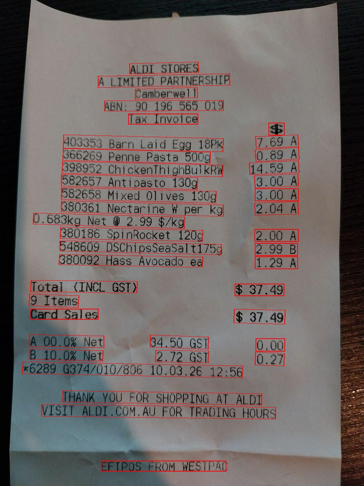
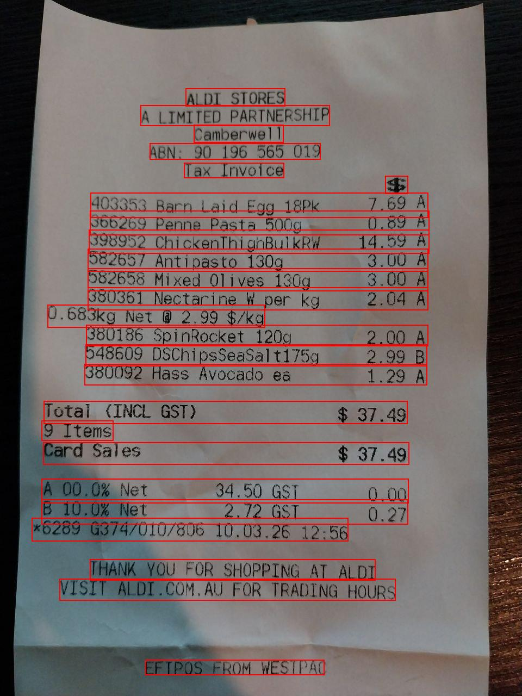

# OCR Playground

A lightweight playground to understand different state-of-the-art Optical Character Recognition (OCR) approaches on real-world documents (e.g. receipts).

The goal of this repository is to compare multiple OCR engines, observe their behaviour, and explore how combining detection + recognition models can significantly improve structured data extraction.

---

## OCR Engines Included

The following OCR methods are implemented:

- **Tesseract** — classical OCR engine (LSTM-based sequence recognition with rule-based layout assumptions)

- **PaddleOCR** — deep learning pipeline:
  - Text detection (DBNet-style CNN detector)
  - Text recognition (CRNN / attention-based models)

- **docTR** — end-to-end deep learning OCR:
  - CNN-based text detection
  - Transformer / attention-based text recognition

- **EasyOCR** — lightweight deep learning OCR:
  - CRAFT text detection (CNN-based)
  - CRNN-based text recognition

- **RapidOCR** — optimised OCR for fast inference:
  - Lightweight CNN detection + recognition models
  - Focused on speed with reasonable accuracy

- **TrOCR** — transformer-based OCR (Vision Transformer + encoder-decoder architecture)
  - Treats OCR as a sequence-to-sequence problem
  - Works best on pre-segmented text regions

- **Paddle + TrOCR (custom pipeline)** — hybrid approach:
  - PaddleOCR for text detection (bounding boxes)
  - Line grouping via spatial heuristics
  - TrOCR for high-quality line-level recognition (transformer-based)
  - Custom parsing into structured JSON

---

## Installation & Usage

```bash
python3 -m venv .venv
source .venv/bin/activate
pip install -r requirements.txt
```

Run the playground:

You can provide the path to an image as input. 

```bash
python OCR_playground.py <image>
```

For example:

```bash
python OCR_playground.py images/ticket1.jpg
```

---

## Project Structure

```bash
.
├── engines/
│   ├── plygrd_tesseract.py
│   ├── plygrd_paddleocr.py
│   ├── plygrd_doctr.py
│   ├── plygrd_easyocr.py
│   ├── plygrd_rapidocr.py
│   ├── plygrd_trocr.py
│   └── plygrd_paddle_trocr.py
├── images/
│   ├── ticket1.jpg
│   └── ticket2.jpg
├── debug/
├── OCR_playground.py
└── requirements.txt
```


---

## Sample Data

Located in the `images/` folder:

- `ticket1.jpg`
- `ticket2.jpg`

These are real receipt-style pictures used to evaluate OCR performance.

---

## Output

Each OCR engine prints its recognised text along with execution time.

Full outputs are also saved in [`output.txt`](output.txt) for easier inspection and comparison.

> Tip: Scroll to the end of the file to see the structured JSON output generated by the Paddle + TrOCR pipeline.


### Key Observations

- **Tesseract**
  - Fast and lightweight
  - Struggles with layout and noisy text
  - Misses structure and introduces artefacts

- **PaddleOCR**
  - Strong baseline
  - Good balance between accuracy and speed
  - Preserves layout reasonably well

- **docTR**
  - Accurate but significantly slower
  - Occasionally mixes ordering of text

- **EasyOCR**
  - Decent performance
  - More errors in spacing and formatting

- **RapidOCR**
  - Very fast
  - Comparable accuracy to PaddleOCR in this use case

- **TrOCR**
  - Fails on full images
  - Requires pre-segmented text regions (not a standalone OCR solution)

---

##  Paddle + TrOCR (Hybrid Pipeline)

This is the most effective approach in this repository.

### How it works

1. **Text Detection** 
   PaddleOCR detects bounding boxes for text regions.

    <p align="center">
        
    </p>

2. **Line Grouping** 
   Bounding boxes are grouped into lines using spatial heuristics.
   
    <p align="center">
        
    </p>

3. **Text Recognition** 
   Each line is passed to TrOCR for high-quality transcription.

4. **Parsing** 
   Regex-based parsing extracts structured data:
   - Item codes
   - Product names
   - Prices
   - Tax categories


### Example JSON Output

```json
{
  "metadata": {
    "total": 37.49,
    "num_items": 9,
    "date": "10.03.26",
    "time": "12:56",
    "store_name": "ALDI STORES"
  },
    {
      "code": "403353",
      "name": "BARN LAID EGG 18PK",
      "price": 7.69,
      "tax": "A"
    },
    {
      "code": "366269",
      "name": "PENNE PASTA 5009",
      "price": 0.89,
      "tax": "A"
    },

    ...

  ]
}
```


### Why it performs best

- Detection and recognition are decoupled
- TrOCR operates on clean, line-level inputs
- Produces both:
  - Clean text output
  - Structured JSON


---

## Key Takeaways

OCR is not just recognition, layout understanding is critical

- Transformer models (like TrOCR) are powerful but depend on good input segmentation

- Hybrid pipelines outperform standalone OCR engines for structured documents

- Simple heuristics (line grouping + regex) go a long way in extracting structured data


This playground is designed to help explore these tradeoffs in practice.

